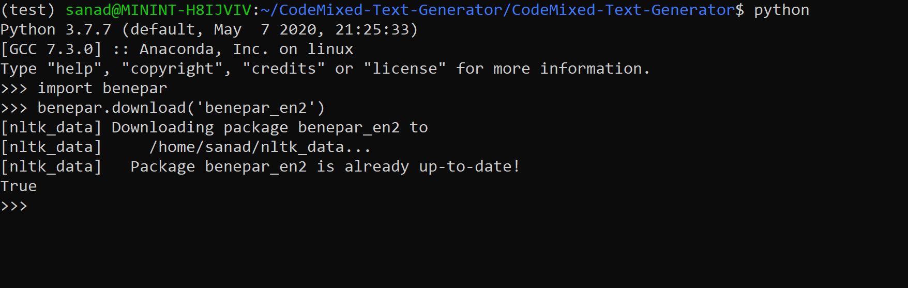
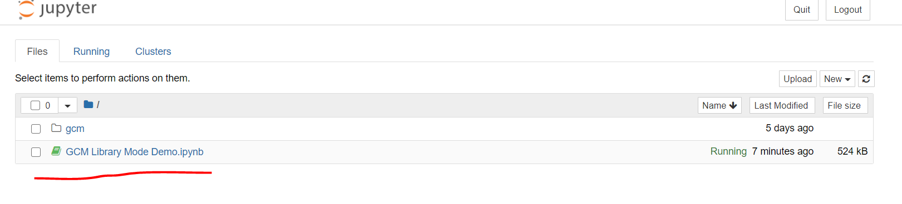
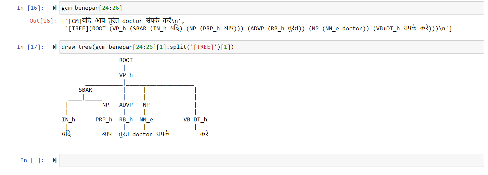
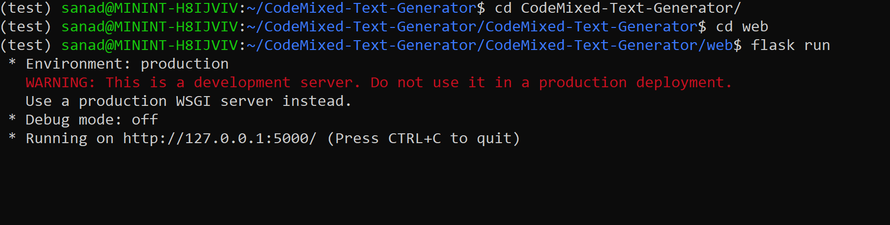
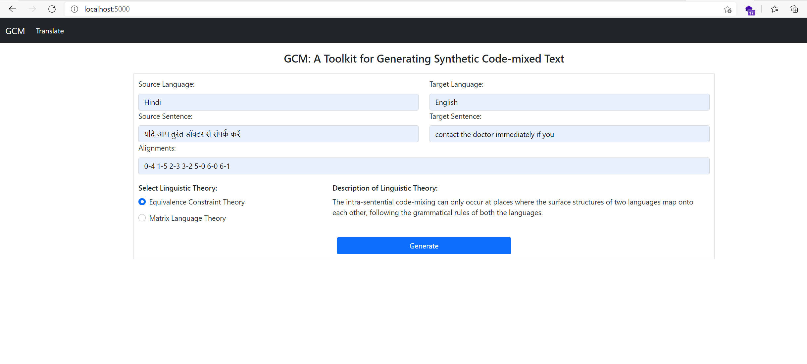
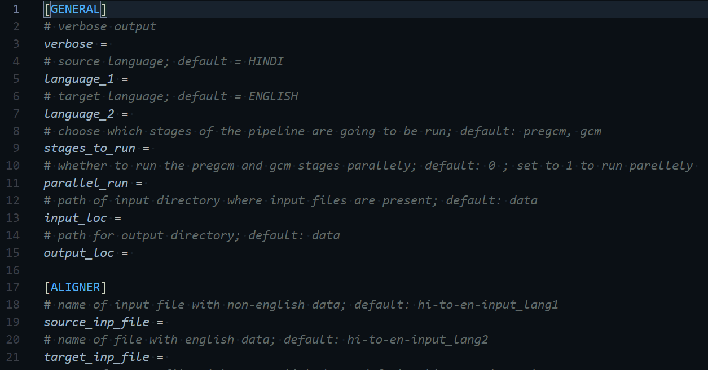

# CodeMixed Text Generator (GCM)
---

[Code-mixing](https://en.wikipedia.org/wiki/Code-mixing) is common in multilingual communities around the world, and processing it is challenging due to the lack of labeled and unlabeled data. We describe a tool that can automatically generate code-mixed data given parallel data in two languages. We implement two linguistic theories of code-mixing, the `Equivalence Constraint theory` and the `Matrix Language theory` to generate all possible code-mixed sentences in the language-pair, followed by sampling of the generated data to generate natural code-mixed sentences. 

The toolkit provides three modes: a `batch mode`, an interactive `library mode` and a `web-interface` to address the needs of researchers, linguists and language experts. 

The toolkit can be used to generate unlabeled text data for pre-trained models, as well as visualize linguistic theories of code-mixing.

**Please read the associated papers in conjunction with the documentation to understand the working of this tool, it's assumptions, corner-cases and the concepts behind it.**

# Table of Contents
---

- [Project Structure](https://github.com/microsoft/CodeMixed-Text-Generator#project-structure)
- [Installation](https://github.com/microsoft/CodeMixed-Text-Generator#installation)
- [Usage](https://github.com/microsoft/CodeMixed-Text-Generator#usage)
- [Cite](https://github.com/microsoft/CodeMixed-Text-Generator#cite)

## Project Structure
---

This project has the following structure:

```python
CodeMixed-Text-Generator/
├── alignment_generator/
├── cm_text_generator/
├── stanford_parser/
├── web/
├── library/
├── utils/
├── aligner.py
├── pre_gcm.py
├── gcm.py
├── config.ini
├── sequence_run.py
├── parallel_run.py
└── requirements.txt
```

Here's more info about each component:
 - **alignment_generator/** - code for downloading and setting up the fast_align aligner.
 - **cm_text_generator/** - implementation of linguistic theories of code-mixing.
 - **stanford_parser/** - code for downloading and setting up the stanford parser.
 - **web/** - web interface for GCM.
 - **library/** - python interface for GCM.
 - **utils** - utility code for the project.
 - **aligner.py** - generates word-level alignments for a corpora of parallel sentences in 2 languages.
 - **pre-gcm.py** - preprocesses the data for the GCM stage.
 - **gcm.py** - generates synthetic code-mixed text based on the data provided by the PRE-GCM stage.
 - **config.ini** - central configuration file of the project. Used for batch-mode interface for GCM.
 - **sequence_run.py** - script to run the GCM pipeline synchronoulsy.
 - **parallel_run.py** - script to run the GCM pipeline asynchronoulsy.
 - **requirements.txt** - python dependencies of the project.

## Papers
---
 - [GCM: A Toolkit for Generating Synthetic Code-mixed Text](https://www.aclweb.org/anthology/2021.eacl-demos.24/)
 - [Language Modeling for Code-Mixing: The Role of Linguistic Theory based Synthetic Data](https://www.aclweb.org/anthology/P18-1143/)
 - [Word Embeddings for Code-Mixed Language Processing](https://www.aclweb.org/anthology/D18-1344/)
 - [Grammatical Constraints on Intra-sentential Code-Switching: From Theories to Working Models
](https://arxiv.org/abs/1612.04538)

## Installation
---

**Note:** This project is developed and tested on Ubuntu and supports only that as an OS. If you want to run it in windows, you can utilize [Windows Subsystem for Linux](https://docs.microsoft.com/en-us/windows/wsl/install-win10).

### I. Installing Pre-requisites

This project has following dependencies as pre-requisites:

1. **Java** - We use Stanford Parser as one of the parsers and for that you need to have java installed in your system, you can get it from here:

```
https://www.oracle.com/java/technologies/javase-jre8-downloads.html
```

2. **CMAKE** - We need cmake for building the fast_align aligner, you can get by using the following command:  

```
sudo apt install cmake
```

3. **Anaconda or Miniconda** - We recommend using one of the two for maintaining a separate environment for Python. You can get Miniconda from here:

```
https://docs.conda.io/en/latest/miniconda.html
```

4. **rsvg library** - You can get it with the following command:

```
sudo apt install librsvg2-bin
```

### II. Setup

1. Clone this repository from GitHub:

```
git clone https://github.com/microsoft/CodeMixed-Text-Generator.git
``` 

2. We specifically need **Python 3.7.7** for the project, you can create a new conda environment for gcm with correct Python version using the following command:

```
conda create -n gcm python==3.7.7
```

Activate the environment:

```
conda activate gcm
```

3. Next, we need to install all the python dependencies. You can use the following set of commands:

```
cd CodeMixed-Text-Generator/CodeMixed-Text-Generator/
```

```
pip install -r requirements.txt
```

The above might take some time based on the speed of your internet connection. 

**Note:** We've tested this toolkit with specific version of `Tensorflow==1.15.4` only.

4. Download and build **fast_align** aligner by using the following set of commands:

```
cd alignment_generator/
```

```
python fast_align_install.py
```

5. Download and install the **Stanford Parser** by using the following set of commands:

```
cd ../stanford_parser/
```

```
python stanford_parser_install.py
```

6. You need to create a **data** folder, this is where all the input/intermediate data files will be stored:

```
cd ../
```

```
mkdir data
```

The above step will take some time based on your internet speed as Stanford Parser is a heavy package.

7. If one of the languages that you want to code-mix is English, download the English language model for Benepar using the following commands:

a. Open a python terminal and write the following code:

```python
import benepar
benepar.download('benepar_en2')
```
Here's how it will look like:



If neither of the languages you're working with is English, then you'll have to download the language model for one of the two languages. You can find them here:

```
https://pypi.org/project/benepar/#usage
```

Once you have finished the above set of steps, you are all ready.

## Usage
---

The toolkit provides three modes: a batch mode, an interactive library mode and a web-interface to address the needs of researchers, linguists and language experts. 

- The general rule of thumb is, if you want to work with single pair of input sentences and visualize the output CM then use the Web UI.
- While you can use the Python library mode if you want to work with a small number of input sentences for experimentation/POC related to CM generation. 
- If you are looking for serious CM corpus generation then use the Batch mode as it provides a lot more flexibility.
- Note that we utilize **back-translation** on input pair of sentences as we've noticed that the GCM tool works best with that. Please refer our papers to understand why. Hence, any interface that you use, it's highly recommended to do the same on every input pair of sentence.

Here's how to use the three modes:

### 1. Library Mode

The library mode is a nifty little Python interface that we have built around the GCM tool, which can be used for quick-prototyping and experimentation. 

Simply go to the **library** directory:

```
cd library
```

You can start jupyter notebook here:

```
jupyter notebook
```

Select the `GCM Library Mode Demo` notebook which has examples on how to run the GCM tool:



And you can import the gcm module and play around with all the sub-modules. 



For more information on using the Library Mode, [Here's the documentation](docs/GCM_Library_Mode_Demo.md).


### 2. Web UI Mode

This is a flask-based web app interface through which you can access the GCM tool in the browser, you can not only generate CM sentences but also visualize the parse trees of generated Code-mixed sentences.

Simply go to the **web** directory:

```
cd web
```

Run the web server:

```
flask run
```



You can access the GCM tool in the browser at the following address:

```
http://localhost:5000/
```




For more information on using the Web UI Mode, [here's the detailed documentation on Web UI Mode.](docs/Web_Mode.md)


### 3. Batch Mode

This is the mode that's designed for large scale generation. It's interface is the **config.ini** file, which has different tuning knobs for different components of the GCM system. 

Feel free to have a look at the [Config File](CodeMixed-Text-Generator/config.ini).



Each of the options are self-explanatory and have default values already present. You can refer the [GCM Paper](https://www.aclweb.org/anthology/2021.eacl-demos.24/) for more information.

Once you have set all the config options, you need to write the input files in the **data** directory. 

Suppose you want to generate Code-mixed for languages Hindi and English as your source and target languages. GCM expects the following four files as input in the data directory:

a. **Source Language Text** - A file containing sentences of the source language (Hindi in this case). The default name of this file that GCM expects is `hi-to-en-input_lang1` where `hi` and `en` are first two letters of the languages to be mixed that's picked from the config file. You can change this setting in the config file.

b. **Target Language Text** - A file containing sentences of the target language (English in this case). The default name of this file that GCM expects is `hi-to-en-input_lang2`. You can change this setting in the config file.

c. **Word-level Alignments** - A file containing word-level alignments between the sentences of the source and target languages. The default name of this file that GCM expects is `hi-to-en-input_parallel_alignments`. You can change this setting in the config file. 

**Note:** You can use GCM's fast_align to automatically generate the **Word-level alignments**. You simply have to add `aligner, pregcm, gcm` to the `stages_to_run` property in the `config file` like this:

```
stages_to_run = aligner, pregcm, gcm
```

d. **PFMS Scores** - A file containing the PFMS scores (refer [this paper](https://www.aclweb.org/anthology/P18-1143/)).  The default name of this file that GCM expects is `hi-to-en_pfms.txt`. You can change this setting in the config file. 

Once you are ready with the above set of input files, you have two options of running the batch mode:

a. **Sequential Data Generation** : This is the straightforward way of running the GCM process. Once you are finished with setting up the config and the input data files, you simply go to the code directory and run this script:

```
python sequence_run.py
```

**The generated Code-mixed text will be in `data/hi-to-en-gcm/out-cm-hi-en.txt`.**

_Again, please note that the names of all of the above files will change based on the first two letters of the languages that are being mixed. This is picked up by the system from the config file. Alternatively, you can not follow the naming convention and give absolute paths to the files in the config file._

b. **Parallel Data Generation** : This is an experimental version, it runs the entire GCM process asynchronously using multiple processes so the over all data generation time is comparatively less. You can start this mode by running the following code:

```
python parallel_run.py --data_dir data --num_procs 2 --output_dir temp_data
```

Where:
 - `--data_dir` is input data directory.
 - `--num_procs` is number of processes to run. This can be the number of the cores in your setup.
 - `--output_dir` is a directory to store intermediate files.


**The generated Code-mixed text will be in `data/hi-to-en-gcm/out-cm-hi-en.txt`.**

**Note:** The parrallel_run.py script is experimental, not extensively tested and might change in the future.

For more information on using the Batch Mode, [here's the detailed documentation on Batch Mode.](docs/Batch_Mode.md)

## Cite
---

If you're using this work, you can cite the following paper:

```bibtex
@inproceedings{rizvi-etal-2021-gcm,
    title = "{GCM}: A Toolkit for Generating Synthetic Code-mixed Text",
    author = "Rizvi, Mohd Sanad Zaki  and
      Srinivasan, Anirudh  and
      Ganu, Tanuja  and
      Choudhury, Monojit  and
      Sitaram, Sunayana",
    booktitle = "Proceedings of the 16th Conference of the European Chapter of the Association for Computational Linguistics: System Demonstrations",
    month = apr,
    year = "2021",
    address = "Online",
    publisher = "Association for Computational Linguistics",
    url = "https://aclanthology.org/2021.eacl-demos.24",
    pages = "205--211",
    abstract = "Code-mixing is common in multilingual communities around the world, and processing it is challenging due to the lack of labeled and unlabeled data. We describe a tool that can automatically generate code-mixed data given parallel data in two languages. We implement two linguistic theories of code-mixing, the Equivalence Constraint theory and the Matrix Language theory to generate all possible code-mixed sentences in the language-pair, followed by sampling of the generated data to generate natural code-mixed sentences. The toolkit provides three modes: a batch mode, an interactive library mode and a web-interface to address the needs of researchers, linguists and language experts. The toolkit can be used to generate unlabeled text data for pre-trained models, as well as visualize linguistic theories of code-mixing. We plan to release the toolkit as open source and extend it by adding more implementations of linguistic theories, visualization techniques and better sampling techniques. We expect that the release of this toolkit will help facilitate more research in code-mixing in diverse language pairs.",
}
```

## Contributors
---

This project is an outcome of collaborative efforts of the following people:

 - [Mohd Sanad Zaki Rizvi](https://github.com/mohdsanadzakirizvi) 
 - Anirudh Srinivasan
 - Adithya Pratapa 
 - Gayatri Bhat
 - Tanuja Ganu
 - Monojit Choudhary
 - Sunayana Sitaram
 - Kalika Bali
 - Sandipan Dandapat


## Contributing
---

This project welcomes contributions and suggestions.  Most contributions require you to agree to a
Contributor License Agreement (CLA) declaring that you have the right to, and actually do, grant us
the rights to use your contribution. For details, visit https://cla.opensource.microsoft.com.

When you submit a pull request, a CLA bot will automatically determine whether you need to provide
a CLA and decorate the PR appropriately (e.g., status check, comment). Simply follow the instructions
provided by the bot. You will only need to do this once across all repos using our CLA.

This project has adopted the [Microsoft Open Source Code of Conduct](https://opensource.microsoft.com/codeofconduct/).
For more information see the [Code of Conduct FAQ](https://opensource.microsoft.com/codeofconduct/faq/) or
contact [opencode@microsoft.com](mailto:opencode@microsoft.com) with any additional questions or comments.

## Trademarks
---

This project may contain trademarks or logos for projects, products, or services. Authorized use of Microsoft 
trademarks or logos is subject to and must follow 
[Microsoft's Trademark & Brand Guidelines](https://www.microsoft.com/en-us/legal/intellectualproperty/trademarks/usage/general).
Use of Microsoft trademarks or logos in modified versions of this project must not cause confusion or imply Microsoft sponsorship.
Any use of third-party trademarks or logos are subject to those third-party's policies.
