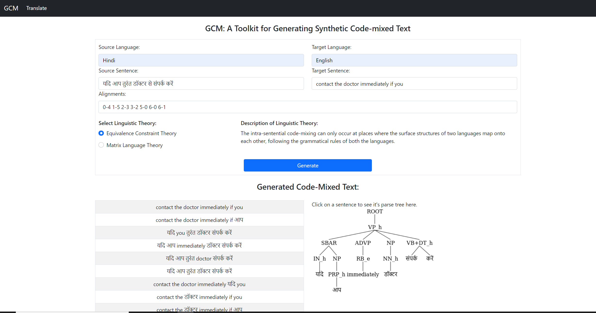
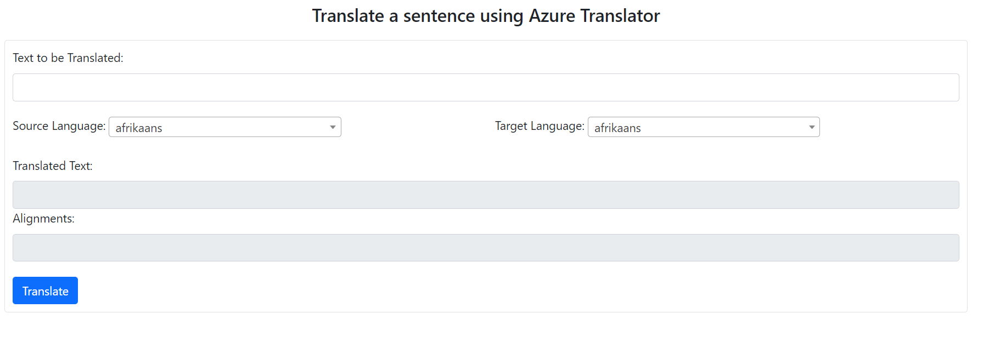

# Web Mode Documentation
---

The Web mode, as discussed earlier is aimed towards people who are interested in CM generation but might not be from technical/CS background. This mode let's you experiment with single pair of input sentences for CM generation, it also let's you visualize the parse trees of the generated CM.

Web mode has two primary functionalities: GCM generation, and Translation using Azure API.

## 1. GCM Generation

Here's how the GCM Generation page of the Web mode looks like:

It's a simple form that should be filled before clicking on the Generate button for the GCM process to start, note that all of these fields are **required** for GCM generation. Here's what each input field means:

1. **Source Language** - This is the source language name, in our example it's Hindi.
2. **Target Language** - This is the target language name, in our example it's English.
3. **Source Sentence** - This is the input sentence of source language.
4. **Target Sentence** - This is the input sentence of target language.
5. **Alignments** - This is the word-level alignment from input sentence in source language to the input sentence in target language. If you don't have the alignments you can utilize the [Translation using Azure API](translation-using-azure-api) to generate the same.
6. **Select Linguistic Theory** - This is to choose which linguistic theory should be used for generating the CM sentences.

Once you've filled the above form and clicked the Generate button, it should only take a couple of minutes for the output to be shown. Please note that sometimes due to bad quality of alignments, there'll be no CM generated and you'll receieve the appropriate failure message.

Here's how the output page looks like:

You'll notice that each CM generated sentence is a row in a table on the left and when you click on one, you'll see the parse tree of that sentence on the right.

## 2. Translation using Azure API

When you click on the **Translate** button in the navigation menu, you'll get access to the translate page:

- This functionality utilizes the Azure Translation API to generate translation and word-level allignments in the format that GCM expects. 
- You have to use **back-translation** to generate alignments between the input pair of sentences.
- You need to sign-up for free version on [Azure Translation API](https://azure.microsoft.com/en-us/services/cognitive-services/translator/), get your `subscription key` and set the value **azure_subscription_key** in the `CodeMixed-Text-Generator/config.ini` file. Make sure that the subscription region is `eastus2`.
